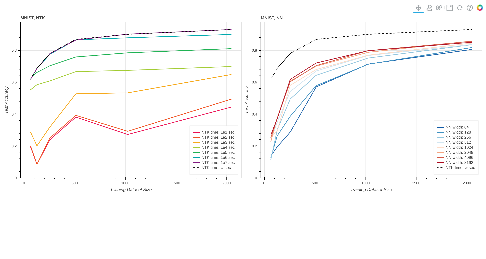

# Motivation

I am very interested in the mathematical mechanism and dynamic changes behind MNIST and NTK, and I am also curious about the working principle behind GP. However, I have not found the experimental results of using NTK on the MNIST dataset on the Internet. So, I share the code I compiled, hoping to promote understanding of NTK.

This work is primarily based on [this notebook](https://github.com/erees1/NNGP/blob/master/nngp_experiments.ipynb), the implementation of paper "[Deep Neural Networks as Gaussian Processes](https://arxiv.org/abs/1711.00165)". The original author used tensorflow to write the neural network model and NTK, and I rewritten it into [Jax](https://github.com/google/jax) and [Neural Tangents](https://github.com/google/neural-tangents) code, and referenced [this notebook](https://github.com/google/jax/blob/main/examples/mnist_classifier.py) a lot at the same time.

# Main Results
- Left: Experiments on NTK. Each curve shows the predictive accuracy when the models are trained using a ```lr=1``` for ```x``` seconds. [1]
- Right: Experiments on three-layered NN of various widths. Models are trained using ```SGD with momentum``` and ```lr=0.001``` for ```20 epochs```.

[1] For details on "how much time the models are trained", please refer to [NTK Prediction](https://neural-tangents.readthedocs.io/en/latest/_autosummary/neural_tangents.predict.gradient_descent_mse_ensemble.html#neural_tangents.predict.gradient_descent_mse_ensemble) )
Right: Experiments on NTK. Each curve shows the predictive accuracy when the models are trained using a learning rate 1 for x seconds.


# Implementation Details
